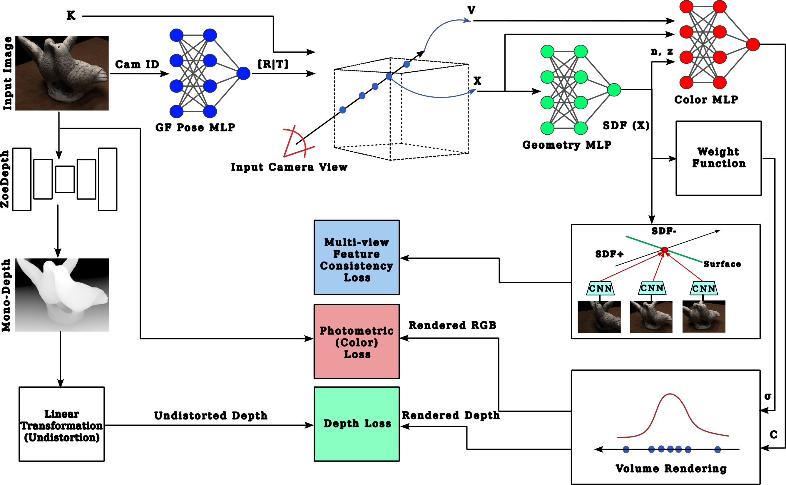

<p align="center">

  <h1 align="center">Bundle-Adjusting NeuS</h1>
  <p align="center">
    <a href="https://darkgeekms.github.io/">Mohamed S. Sabae</a>
    ·
    <a href="https://scholar.google.com/citations?user=i1qvgx4AAAAJ&hl=en">Hoda A. Baraka</a>
    ·
    <a href="https://scholar.google.com/citations?user=38yr_I8AAAAJ&hl=en">Mayada M. Hadhoud</a>

  </p>
  <h3 align="center"><a href="https://arxiv.org/abs/2312.15238">Original Paper</a> | <a href="">Extended Paper</a> | <a href="https://darkgeekms.github.io/bundle-adjusting-neus/">Project Page</a></h3>
  <div align="center"></div>
</p>

<p align="center">
  <a href="">
    
  </a>
</p>

<p align="center">
Neural implicit surface reconstruction method that extends NeuS by enabling joint camera pose optimization.
</p>

# Installation

- Clone the repository:

```bash
git clone https://github.com/DarkGeekMS/bundle-adjusting-neus.git
cd bundle-adjusting-neus
pip install -r requirements.txt
```

- Refer to [NeuS](https://github.com/Totoro97/NeuS) for more information on data convention.

# Usage

- Train with no pose priors:

```shell
python main.py --mode train --conf ./configs/ba_no_poses.conf --case <case_name>
```

- Train with noisy pose priors:

```shell
python main.py --mode train --conf ./configs/ba_noisy_poses.conf --case <case_name>
```

- Extract surface from trained model:

```shell
python main.py --mode validate_mesh --conf <config_file> --case <case_name> --is_continue # use latest checkpoint
```

The corresponding mesh can be found in `exp/<case_name>/<exp_name>/meshes/<iter_steps>.ply`.

- View interpolation:

```shell
python main.py --mode interpolate_<img_idx_0>_<img_idx_1> --conf <config_file> --case <case_name> --is_continue # use latest checkpoint
```

The corresponding image set of view interpolation can be found in `exp/<case_name>/<exp_name>/render/`.
